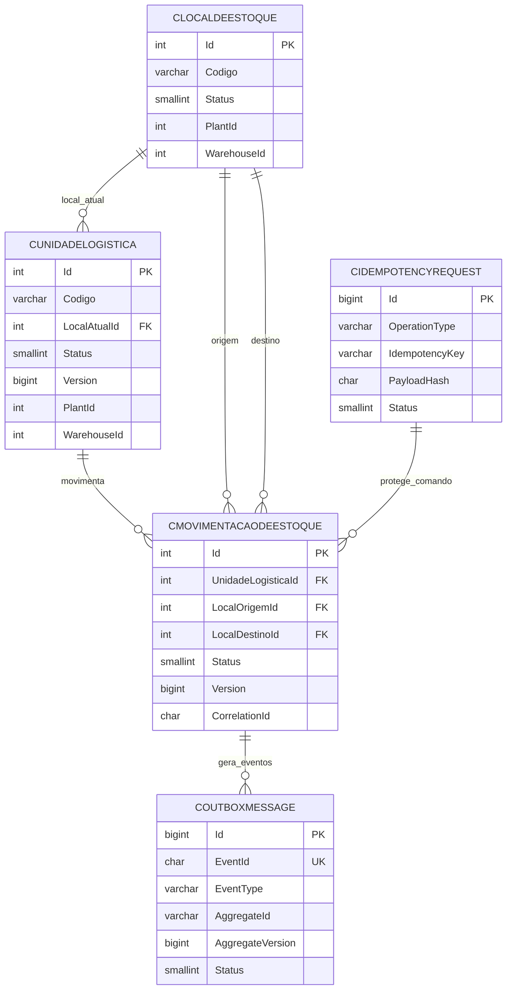

# Contrato de Persistencia da Primeira Vertical de Estoque

## 1. Objetivo

Especificar o contrato tecnico de persistencia para a primeira vertical funcional de Estoque, restrita aos casos de uso `CriarMovimentacaoDeEstoque` e `ConfirmarMovimentacaoDeEstoque`.

Este documento nao implementa persistencia concreta. Ele define o modelo minimo para orientar uma etapa posterior de infraestrutura com EF Core, MySQL, repositories concretos, Unit of Work concreto, idempotencia persistida e transactional outbox.

## 2. Escopo

Incluido:

- persistencia de `UnidadeLogistica`;
- persistencia de `LocalDeEstoque`;
- persistencia de `MovimentacaoDeEstoque`;
- idempotencia persistida dos comandos da primeira vertical;
- transactional outbox dos eventos da primeira vertical;
- concorrencia otimista;
- exclusividade de movimentacao ativa por Unidade Logistica;
- reserva transacional de movimentacao ativa por Unidade Logistica;
- contrato futuro de repositories e Unit of Work;
- recuperacao de falhas e compatibilidade com legado.

Fora de escopo:

- migrations executaveis;
- DbContext e mappings EF Core;
- repository concreto;
- Unit of Work concreto;
- controller, endpoint, frontend, worker ou broker;
- cancelamento, rejeicao, consulta historica e integracao externa.

## 3. Fontes e rastreabilidade

| Fonte | Uso nesta especificacao |
|---|---|
| AS-0004 | Catalogo de Aggregate Roots de Estoque. |
| AS-0005 | Recorte da primeira vertical funcional. |
| AS-0006 | Prontidao e riscos tecnicos. |
| AS-0007 | Arquitetura tecnica implementavel da primeira vertical. |
| DL-0033 | Idempotencia dos comandos. |
| DL-0034 | Concorrencia otimista e exclusividade de UL. |
| DL-0035 | Fronteira transacional. |
| DL-0036 | Transactional Outbox. |
| DL-0037 | Coexistencia com legado. |
| DL-0038 | Persistencia de LocalDeEstoque e relacao com legado. |
| DL-0039 | Exclusividade ativa por reserva transacional. |
| DL-0040 | Identificadores e retencao operacional. |
| DL-0041 | Transicao do legado de Localizacao para Local de Estoque MES. |
| `BACKEND/PRPA/App.Domain/Entities/Estoque` | Propriedades e invariantes dos agregados novos. |
| `BACKEND/PRPA/App.Service/Services/Estoque` | Contratos abstratos da camada de aplicacao. |
| `BACKEND/PRPA/App.Infra.Data` | Padroes existentes de EF Core, MySQL, mappings e migrations. |
| `Inventario da Implementacao Legada de Locais de Estoque.md` | Inventario de componentes, transicao, fonte da verdade e ocupacao. |

## 4. Ambiente de persistencia existente

| Item | Padrao encontrado | Evidencia | Aplicacao no Estoque |
|---|---|---|---|
| Banco | MySQL | `PRPA/Program.cs` usa `UseMySql` e `ServerVersion.AutoDetect`. | A especificacao assume MySQL como alvo inicial. |
| Provider EF | Pomelo.EntityFrameworkCore.MySql 8.0.0 | `App.Infra.Data/App.Infra.Data.csproj`. | Tipos fisicos devem ser compativeis com Pomelo. |
| EF Core | 8.0.0 | `.csproj` da infra e API. | Mappings futuros via Fluent API. |
| Migrations | Projeto `App.Infra.Data` | `MigrationsAssembly("App.Infra.Data")`. | Migration futura deve ficar em `App.Infra.Data/Migrations`. |
| DbContext principal | `ProjetoContext` | `App.Infra.Data/Context/ProjetoContext.cs`. | Novos DbSets, se aprovados, pertencem ao contexto principal. |
| Schema | Nao identificado schema nomeado | `ToTable("C...")` sem schema. | Usar schema padrao do banco, salvo decisao futura. |
| Nome de tabela | Prefixo `C` em muitas tabelas | `CPRODUTO`, `CLOCALIZACAOESTOQUE`, `CMOVIMENTOESTOQUE`. | Tabelas novas propostas usam prefixo `C`. |
| Chave primaria | `int` identity | Snapshot EF com `ValueGeneratedOnAdd()` e `int`. | IDs dos Value Objects atuais sao `int`; manter compatibilidade. |
| Data/hora | `datetime(6)` | Snapshot EF. | Datas novas devem usar UTC e precisao `datetime(6)`. |
| Auditoria | `DataCriacao`, `DataEdicao`, `UsuarioCriacao`, `UsuarioEdicao` | `BaseEntity`. | Novos agregados podem manter datas tecnicas, mas timestamps de dominio nao devem ser sobrescritos por defaults. |
| Delete behavior | `Restrict` global | `ProjetoContext.OnModelCreating`. | FKs novas devem ser restritas. |
| Versionamento | Nao ha padrao claro em estoque legado | Mappings legados nao mostram concurrency token. | Novos agregados exigem coluna `Version` conforme DL-0034. |
| Outbox | Nao identificado | Busca local nao encontrou tabela/contrato persistido. | Criar tabela conceitual nova em etapa futura. |
| Idempotencia | Nao identificada persistida | Apenas contrato abstrato em `App.Service`. | Criar tabela conceitual nova em etapa futura. |
| Transacao atual | UoW EF com `BeginTransaction`, `SaveAsync`, commit/rollback | `App.Infra.Data/Persistence/UnitOfWork.cs`. | Novo UoW deve coordenar agregados, idempotencia e outbox na mesma transacao. |

## 5. Agregados persistidos

| Aggregate Root | Tabela proposta | Chave | Versao | Estado | Relacoes | Estrategia |
|---|---|---|---|---|---|---|
| `UnidadeLogistica` | `CUNIDADELOGISTICA` | `Id int` | `Version bigint` | `Status smallint` | `LocalAtualId` -> `CLOCALDEESTOQUE`; Produto e UnidadeMedida por referencia `int`. | Persistir posicao atual transacional da UL e atualizar por versao. |
| `LocalDeEstoque` | `CLOCALDEESTOQUE` | `Id int` | Opcional nesta slice | `Status smallint` | Correlacao opcional com `CLOCALIZACAOESTOQUE.Id`, sem FK fisica e sem escrita no legado. | Materializar codigo, status, PlantId e WarehouseId para validacao de origem/destino. |
| `MovimentacaoDeEstoque` | `CMOVIMENTACAODEESTOQUE` | `Id int` | `Version bigint` | `Status smallint` | Referencia UL, local origem e local destino. | Persistir processo operacional criado/confirmado, sem usar `CMOVIMENTOESTOQUE` legado como AR. |

## 6. Modelo relacional minimo

| Campo | Tabela | Tipo logico | Obrigatorio | Indice | Constraint | Justificativa |
|---|---|---|---|---|---|---|
| `Id` | Todas de agregado | int identity | Sim | PK | `> 0` | Compatibilidade com Value Objects atuais e padrao existente. |
| `Codigo` | `CUNIDADELOGISTICA` | varchar(80) | Sim | Unique por warehouse | NOT NULL | Identidade operacional da UL. |
| `ProdutoId` | `CUNIDADELOGISTICA` | int | Sim | Sim | FK futura ou referencia catalogo | Conteudo minimo da UL. |
| `Quantidade` | `CUNIDADELOGISTICA` | decimal(18,4) | Sim | Nao | `> 0` | Invariante de quantidade valida. |
| `UnidadeMedidaId` | `CUNIDADELOGISTICA` | int | Sim | Sim | FK futura | Unidade da quantidade. |
| `LocalAtualId` | `CUNIDADELOGISTICA` | int | Sim | Sim | FK para local | Fonte transacional da posicao atual. |
| `Status` | `CUNIDADELOGISTICA` | smallint | Sim | Sim | CHECK conceitual | Ativa ou EmMovimentacao na primeira slice. |
| `Version` | `CUNIDADELOGISTICA` | bigint | Sim | Sim | `>= 0` | Concorrencia otimista. |
| `PlantId` | Todas | int | Sim | Composto | `> 0` | Segmentacao operacional. |
| `WarehouseId` | Todas | int | Sim | Composto | `> 0` | Evita movimentacao entre warehouses. |
| `DataCriacao` | `CUNIDADELOGISTICA`, `CLOCALDEESTOQUE` | datetime(6) UTC | Sim | Nao | NOT NULL | Data tecnica/dominio inicial. |
| `DataAtualizacao` | Todas | datetime(6) UTC | Nao | Nao | - | Auditoria tecnica; nao substitui datas de dominio. |
| `Codigo` | `CLOCALDEESTOQUE` | varchar(80) | Sim | Unique por warehouse | NOT NULL | Identidade operacional do local. |
| `Status` | `CLOCALDEESTOQUE` | smallint | Sim | Sim | CHECK conceitual | Ativo, Bloqueado, Desativado. |
| `UnidadeLogisticaId` | `CMOVIMENTACAODEESTOQUE` | int | Sim | Sim | FK | UL movimentada. |
| `LocalOrigemId` | `CMOVIMENTACAODEESTOQUE` | int | Sim | Sim | FK | Origem validada. |
| `LocalDestinoId` | `CMOVIMENTACAODEESTOQUE` | int | Sim | Sim | FK | Destino validado. |
| `Quantidade` | `CMOVIMENTACAODEESTOQUE` | decimal(18,4) | Sim | Nao | `> 0` | Snapshot da quantidade movimentada. |
| `UnidadeMedidaId` | `CMOVIMENTACAODEESTOQUE` | int | Sim | Sim | FK futura | Unidade do snapshot. |
| `Motivo` | `CMOVIMENTACAODEESTOQUE` | varchar(500) | Nao | Nao | - | Motivo opcional ja modelado no dominio. |
| `Status` | `CMOVIMENTACAODEESTOQUE` | smallint | Sim | Sim | CHECK conceitual | Solicitada ou Confirmada nesta slice. |
| `DataSolicitacao` | `CMOVIMENTACAODEESTOQUE` | datetime(6) UTC | Sim | Sim | NOT NULL | Timestamp de dominio. |
| `DataConfirmacao` | `CMOVIMENTACAODEESTOQUE` | datetime(6) UTC | Nao | Sim | `>= DataSolicitacao` quando preenchido | Confirmacao posterior. |
| `SolicitanteId` | `CMOVIMENTACAODEESTOQUE` | int | Sim | Sim | `> 0` | Ator da criacao. |
| `ConfirmadorId` | `CMOVIMENTACAODEESTOQUE` | int | Nao | Sim | `> 0` quando preenchido | Ator da confirmacao. |
| `CorrelationId` | `CMOVIMENTACAODEESTOQUE` | char(36) | Sim | Sim | GUID valido | Rastreamento da jornada. |
| `CausationId` | `CMOVIMENTACAODEESTOQUE` | char(36) | Sim | Sim | GUID valido | Causalidade de evento/comando. |
| `IdempotencyKeyCriacao` | `CMOVIMENTACAODEESTOQUE` | varchar(150) | Sim | Sim | NOT NULL | Rastreio local do comando de criacao. |
| `IdempotencyKeyConfirmacao` | `CMOVIMENTACAODEESTOQUE` | varchar(150) | Nao | Sim | - | Rastreio local do comando de confirmacao. |
| `Version` | `CMOVIMENTACAODEESTOQUE` | bigint | Sim | Sim | `>= 0` | Concorrencia otimista da movimentacao. |
| `UnidadeLogisticaId` | `CUNIDADELOGISTICAMOVEMENTRESERVATION` | int | Sim | Unique composto | FK/logica para UL | UL reservada por movimentacao ativa. |
| `MovimentacaoDeEstoqueId` | `CUNIDADELOGISTICAMOVEMENTRESERVATION` | int | Sim | Unique | FK/logica para movimentacao | Movimentacao que detem a reserva. |
| `PlantId` | `CUNIDADELOGISTICAMOVEMENTRESERVATION` | int | Sim | Composto | `> 0` | Escopo operacional. |
| `WarehouseId` | `CUNIDADELOGISTICAMOVEMENTRESERVATION` | int | Sim | Unique composto | `> 0` | Escopo da exclusividade ativa. |
| `CreatedAt` | `CUNIDADELOGISTICAMOVEMENTRESERVATION` | datetime(6) UTC | Sim | Sim | NOT NULL | Auditoria tecnica da reserva. |

## 7. Chaves e identificadores

| Identificador | Tipo fisico recomendado | Nulabilidade | Geracao | Observacao |
|---|---|---|---|---|
| `UnidadeLogisticaId` | int | NOT NULL | Banco ou alocador aprovado futuro | Value Object atual encapsula `int`. |
| `LocalDeEstoqueId` | int | NOT NULL | Banco/alocador da nova tabela; correlacao opcional com legado | `CLOCALIZACAOESTOQUE` nao gera a identidade do novo AR. |
| `MovimentacaoDeEstoqueId` | int | NOT NULL | Alocador de persistencia antes da criacao do agregado | A aplicacao deve obter o ID antes do evento de dominio; nao depender de auto-incremento pos-insert para eventos. |
| `ActorId` | int | NOT NULL | Identidade/autenticacao | Nao criar FK direta com Identity sem decisao. |
| `CorrelationId` | char(36) | NOT NULL | Chamador/orquestrador | Usar representacao GUID estavel. |
| `CausationId` | char(36) | NOT NULL | Chamador/orquestrador | Quando nao houver causa externa, pode receber a correlacao conforme aplicacao atual. |
| `EventId` | char(36) | NOT NULL | Dominio | Unico na outbox. |

Decisao consolidada: identificadores fisicos de ARs permanecem `int`; eventos e correlacoes usam GUID em `char(36)`. A estrategia concreta de alocacao sera implementada na infraestrutura, sem alterar os Value Objects atuais.

## 8. Versionamento e concorrencia otimista

| Agregado | Coluna de versao | Tipo | Incremento | Validacao | Conflito |
|---|---|---|---|---|---|
| `UnidadeLogistica` | `Version` | bigint | Dominio incrementa; persistencia valida | Comparar `ExpectedUnidadeLogisticaVersion` e update condicionado | `Estoque.Application.VersaoConflitante` ou erro equivalente estavel. |
| `MovimentacaoDeEstoque` | `Version` | bigint | Dominio incrementa; persistencia valida | Comparar `ExpectedMovimentacaoDeEstoqueVersion` e update condicionado | Mesmo erro estavel. |
| `LocalDeEstoque` | `Version` | bigint opcional | Nao exigido para leitura nesta slice | Validar estado carregado | Se alteravel concorrentemente no futuro, exigir versionamento. |

Pseudocodigo conceitual nao executavel:

```text
UPDATE CUNIDADELOGISTICA
SET LocalAtualId = @destino, Status = @ativa, Version = @novaVersao
WHERE Id = @id AND Version = @expectedVersion;

se linhas_afetadas = 0:
  rollback transacao
  nao marcar idempotencia como Completed
  nao publicar outbox
  retornar conflito de versao
```

O mesmo principio vale para `CMOVIMENTACAODEESTOQUE`.

## 9. Exclusividade de movimentacao ativa

| Alternativa | Garantia | Portabilidade | Complexidade | Risco | Recomendacao |
|---|---|---|---|---|---|
| Indice unico parcial/filtrado por `Status = Solicitada` | Alta | Baixa em MySQL puro | Baixa quando suportado | MySQL pode nao suportar filtro nativo como SQL Server/PostgreSQL | Usar apenas se implementacao MySQL suportar equivalente confiavel. |
| Coluna gerada `ActiveUnidadeLogisticaId` unica | Alta | Media em MySQL | Media | Exige mapping especifico | Rejeitada para a primeira implementacao por depender de suporte/mapping especifico nao validado no ambiente. |
| Tabela de reserva `CUNIDADELOGISTICAMOVEMENTRESERVATION` | Alta | Alta | Media | Mais uma tabela e liberacao transacional | Aprovada como mecanismo fisico inicial. |
| Coluna `MovimentacaoAtivaId` na UL | Media | Alta | Media | Acopla UL ao processo e exige limpeza rigorosa | Aceitavel se modelada como estado transacional da UL. |
| Apenas status `EmMovimentacao` + versionamento | Media | Alta | Baixa | Pode falhar sob concorrencia entre instancias se nao houver update condicionado correto | Necessario, mas nao suficiente sozinho. |
| Lock pessimista | Alta | Media | Alta | Contencao e risco operacional | Nao recomendado para primeira implementacao. |
| Serializable | Alta | Media | Alta | Custo alto e deadlocks | Nao usar como mecanismo primario. |

Contrato:

- `IUnidadeLogisticaMovementAvailabilityChecker` faz verificacao previa de existencia de movimentacao ativa.
- A tabela de reserva possui unicidade por `WarehouseId, UnidadeLogisticaId` e garante que duas movimentacoes ativas para a mesma UL nao coexistam na mesma janela concorrente.
- A versao da UL garante que a posicao/status carregados ainda sao atuais no commit.
- O Unit of Work garante atomicidade entre movimentacao, UL, idempotencia e outbox.
- A reserva e criada junto da movimentacao solicitada e liberada na confirmacao, sempre na mesma transacao dos agregados, idempotencia e outbox.

## 10. Idempotencia persistida

Tabela proposta: `CIDEMPOTENCYREQUEST`.

| Campo | Tipo logico | Obrigatorio | Indice | Funcao |
|---|---|---|---|---|
| `Id` | bigint identity | Sim | PK | Chave tecnica. |
| `OperationType` | varchar(120) | Sim | Unique composto | Nome do comando. |
| `ActorOrClientId` | varchar(120) | Sim | Unique composto | Escopo do solicitante. |
| `IdempotencyKey` | varchar(150) | Sim | Unique composto | Chave fornecida. |
| `PayloadHash` | char(64) | Sim | Sim | SHA-256 hex do payload. |
| `Status` | smallint | Sim | Sim | InProgress, Completed, FailedRecoverable, Expired. |
| `ResultPayload` | json/text | Nao | Nao | Resultado recuperavel para replay. |
| `ErrorCode` | varchar(200) | Nao | Sim | Falha recuperavel. |
| `CreatedAt` | datetime(6) UTC | Sim | Sim | Criacao. |
| `UpdatedAt` | datetime(6) UTC | Sim | Nao | Ultima alteracao. |
| `CompletedAt` | datetime(6) UTC | Nao | Sim | Conclusao. |
| `ExpiresAt` | datetime(6) UTC | Nao | Sim | TTL futuro. |
| `CorrelationId` | char(36) | Sim | Sim | Rastreabilidade. |
| `PlantId` | int | Nao | Composto | Escopo operacional quando conhecido. |
| `WarehouseId` | int | Nao | Composto | Escopo operacional quando conhecido. |
| `AttemptCount` | int | Sim | Nao | Observabilidade de retries. |
| `LockedUntil` | datetime(6) UTC | Nao | Sim | Recuperacao de processamento travado. |

Estados:

- `InProgress`: primeira execucao iniciou e ainda nao concluiu.
- `Completed`: resultado persistido e recuperavel.
- `FailedRecoverable`: falha antes do commit ou falha recuperavel; retry permitido conforme politica.
- `Expired`: chave fora da janela de retencao, se TTL for aprovado.
- `Conflict`: nao precisa ser persistido; pode ser resposta derivada de mesma chave com payload diferente.

Fluxos:

| Cenario | Comportamento especificado |
|---|---|
| Primeira execucao | Inserir `InProgress`, executar dominio e preparar `Completed` na mesma transacao. |
| Replay concluido | Encontrar `Completed`, validar mesmo `PayloadHash`, retornar `ResultPayload`. |
| Payload divergente | Retornar conflito sem executar dominio e sem alterar agregados. |
| Em andamento | Retornar processamento em andamento ou aplicar retry depois de `LockedUntil`. |
| Falha antes do commit | Rollback nao deve deixar `Completed`; pode manter/registrar `FailedRecoverable` conforme transacao adotada. |
| Falha apos commit | Como idempotencia e outbox estao na mesma transacao, commit confirmado deve conter resultado; se resposta HTTP falhar, replay devolve resultado. |
| Expiracao | TTL nao definido nesta Architecture Session; propor definicao operacional futura. |

## 11. Transactional Outbox

Tabela proposta: `COUTBOXMESSAGE`.

| Campo | Tipo logico | Obrigatorio | Indice | Funcao |
|---|---|---|---|---|
| `Id` | bigint identity | Sim | PK | Chave tecnica. |
| `EventId` | char(36) | Sim | Unique | Idempotencia de publicacao. |
| `EventType` | varchar(200) | Sim | Sim | Tipo do evento. |
| `EventVersion` | int | Sim | Sim | Versao do schema. |
| `AggregateType` | varchar(120) | Sim | Composto | Ordenacao por agregado. |
| `AggregateId` | varchar(80) | Sim | Composto | Ordenacao por agregado. |
| `AggregateVersion` | bigint | Sim | Composto | Ordem logica do agregado. |
| `OccurredAt` | datetime(6) UTC | Sim | Sim | Tempo de dominio. |
| `CorrelationId` | char(36) | Sim | Sim | Rastreabilidade. |
| `CausationId` | char(36) | Sim | Sim | Causalidade. |
| `PlantId` | int | Sim | Composto | Escopo. |
| `WarehouseId` | int | Sim | Composto | Escopo. |
| `ActorId` | int | Sim | Sim | Ator. |
| `Source` | varchar(80) | Sim | Sim | Origem, ex.: MES. |
| `Payload` | json/text | Sim | Nao | Evento serializado. |
| `Headers` | json/text | Nao | Nao | Metadados opcionais. |
| `Status` | smallint | Sim | Sim | Pending, Processing, Published, Failed, DeadLetter. |
| `AttemptCount` | int | Sim | Sim | Retentativas. |
| `NextAttemptAt` | datetime(6) UTC | Nao | Sim | Agendamento. |
| `ProcessedAt` | datetime(6) UTC | Nao | Sim | Publicacao. |
| `LastError` | varchar(2000) | Nao | Nao | Diagnostico. |
| `CreatedAt` | datetime(6) UTC | Sim | Sim | Criacao da mensagem. |

`ITransactionalDomainEventCollector.StageAsync` nao publica, nao chama broker e nao executa consumidor. A implementacao futura deve converter eventos para linhas de outbox dentro da mesma transacao do UoW. Publicacao externa ocorre somente apos commit.

## 12. Fronteira transacional

| Caso de uso | Operacoes na transacao | Operacoes apos commit |
|---|---|---|
| CriarMovimentacaoDeEstoque | Inserir movimentacao solicitada; atualizar UL para `EmMovimentacao`; validar/update por versao; garantir exclusividade ativa; gravar idempotencia `Completed`; gravar outbox `MovimentacaoDeEstoqueCriada`; incrementar versoes. | Publicar outbox; metricas; logs externos; notificacoes futuras. |
| ConfirmarMovimentacaoDeEstoque | Atualizar movimentacao para `Confirmada`; atualizar UL para `Ativa` e destino; validar/update por versao; gravar idempotencia `Completed`; gravar outbox `MovimentacaoDeEstoqueConfirmada` e `PosicaoDaUnidadeLogisticaAlterada`; incrementar versoes. | Publicar outbox; metricas; logs externos; notificacoes futuras. |

Antes do commit e proibido publicar em broker, chamar integracao externa irreversivel ou concluir idempotencia fora da transacao.

## 13. Contrato futuro dos repositories

| Interface | Metodo atual | Semantica futura | Concorrencia | Transacao |
|---|---|---|---|---|
| `IUnidadeLogisticaRepository` | `GetByIdAsync` | Carregar agregado completo para comando. | Deve carregar `Version`. | Mesmo DbContext/UoW. |
| `IUnidadeLogisticaRepository` | `UpdateAsync` | Marcar alteracao da UL. | Update condicionado por `Id` e `Version` esperada. | Commit unico. |
| `ILocalDeEstoqueRepository` | `GetByIdAsync` | Carregar local para validacao de origem/destino. | Leitura consistente; versionamento opcional nesta slice. | Dentro da transacao quando usado no comando. |
| `IMovimentacaoDeEstoqueRepository` | `GetByIdAsync` | Carregar movimentacao para confirmar. | Deve carregar `Version`. | Mesmo DbContext/UoW. |
| `IMovimentacaoDeEstoqueRepository` | `AddAsync` | Registrar nova movimentacao solicitada. | Deve respeitar exclusividade ativa. | Commit unico. |
| `IMovimentacaoDeEstoqueRepository` | `UpdateAsync` | Marcar confirmacao. | Update condicionado por versao. | Commit unico. |

Repositories nao devem expor `IQueryable`, DbContext, DTO de infra, controller ou query de saldo como autoridade. `LocalDeEstoque` pode ser materializado a partir do legado, mas a camada anticorrupcao deve preservar a semantica nova.

## 14. Contrato futuro do Unit of Work

O `IEstoqueApplicationUnitOfWork.CommitAsync` devera representar uma unica transacao local que coordena:

- repositories dos agregados;
- update condicionado por versao;
- constraint de exclusividade ativa;
- staging de idempotencia;
- staging de outbox;
- rollback em falha;
- traducao estavel de conflito de concorrencia.

| Isolamento | Beneficio | Custo | Adequacao |
|---|---|---|---|
| Read Committed | Padrao simples e menor contencao. | Precisa de constraints e updates condicionados corretos. | Recomendado inicialmente com constraints. |
| Repeatable Read | Consistencia maior durante leitura. | Pode aumentar locks dependendo do MySQL/InnoDB. | Avaliar se leituras concorrentes gerarem anomalias. |
| Serializable | Bloqueia mais anomalias. | Alto custo e risco de deadlock. | Nao recomendado como padrao inicial. |
| Snapshot | Boa leitura consistente. | Depende de configuracao/provider. | Nao assumir sem validacao. |

Rollback explicito na interface nao e obrigatorio se a implementacao encapsular transacao e descartar alteracoes ao falhar. Retry automatico de dominio nao deve ocorrer em conflito de versao.

## 15. Indices minimos

| Tabela | Indice | Colunas | Unico | Filtrado | Justificativa |
|---|---|---|---|---|---|
| `CUNIDADELOGISTICA` | `IX_UL_Codigo_Warehouse` | `PlantId, WarehouseId, Codigo` | Sim | Nao | Identidade operacional no escopo. |
| `CUNIDADELOGISTICA` | `IX_UL_Local_Status` | `PlantId, WarehouseId, LocalAtualId, Status` | Nao | Nao | Consultas e validacoes por local/status. |
| `CUNIDADELOGISTICA` | `IX_UL_Version` | `Id, Version` | Nao | Nao | Update condicionado. |
| `CLOCALDEESTOQUE` | `IX_Local_Codigo_Warehouse` | `PlantId, WarehouseId, Codigo` | Sim | Nao | Unicidade do local por escopo. |
| `CLOCALDEESTOQUE` | `IX_Local_Status` | `PlantId, WarehouseId, Status` | Nao | Nao | Validacao de origem/destino. |
| `CMOVIMENTACAODEESTOQUE` | `IX_Mov_UL_Status` | `UnidadeLogisticaId, Status` | Nao | Nao | Verificacao previa de ativa. |
| `CUNIDADELOGISTICAMOVEMENTRESERVATION` | `UX_ULMovementReservation_Warehouse_Unidade` | `WarehouseId, UnidadeLogisticaId` | Sim | Nao | Exclusividade ativa por UL em MySQL sem indice filtrado. |
| `CMOVIMENTACAODEESTOQUE` | `IX_Mov_Correlation` | `CorrelationId` | Nao | Nao | Rastreabilidade. |
| `CMOVIMENTACAODEESTOQUE` | `IX_Mov_Datas` | `DataSolicitacao, DataConfirmacao` | Nao | Nao | Consultas futuras. |
| `CIDEMPOTENCYREQUEST` | `UX_Idempotency_Key` | `OperationType, ActorOrClientId, IdempotencyKey` | Sim | Nao | Chave idempotente. |
| `CIDEMPOTENCYREQUEST` | `IX_Idempotency_Status_Expires` | `Status, ExpiresAt` | Nao | Nao | Limpeza e recuperacao. |
| `COUTBOXMESSAGE` | `UX_Outbox_EventId` | `EventId` | Sim | Nao | Idempotencia de publicacao. |
| `COUTBOXMESSAGE` | `IX_Outbox_Processamento` | `Status, NextAttemptAt, CreatedAt` | Nao | Nao | Worker futuro. |
| `COUTBOXMESSAGE` | `IX_Outbox_Aggregate` | `AggregateType, AggregateId, AggregateVersion` | Nao | Nao | Ordenacao por agregado. |
| `COUTBOXMESSAGE` | `IX_Outbox_Correlation` | `CorrelationId` | Nao | Nao | Rastreabilidade. |

## 16. Constraints

| Constraint | Tabela | Regra | Banco | Dominio | Observacao |
|---|---|---|---|---|---|
| PK | Todas | `Id` obrigatorio | Sim | Sim | Estrutural. |
| FK UL/local atual | `CUNIDADELOGISTICA` | Local atual existente | Sim | Sim | Delete restrict. |
| FK movimento/UL | `CMOVIMENTACAODEESTOQUE` | UL existente | Sim | Sim | Delete restrict. |
| FK movimento/origem/destino | `CMOVIMENTACAODEESTOQUE` | Locais existentes | Sim | Sim | Delete restrict. |
| Origem diferente destino | `CMOVIMENTACAODEESTOQUE` | `LocalOrigemId <> LocalDestinoId` | Sim | Sim | Regra estrutural simples. |
| Status valido | Todas | valores enumerados | Sim, se CHECK aprovado | Sim | Pode ser validado por enum smallint. |
| Versao nao negativa | UL e Movimentacao | `Version >= 0` | Sim | Sim | Concorrencia. |
| Data confirmacao | Movimentacao | `DataConfirmacao >= DataSolicitacao` quando preenchida | Sim | Sim | Integridade temporal. |
| Exclusividade ativa | Reserva transacional | uma reserva ativa por UL no warehouse | Sim | Sim | Garantia concorrente por unicidade fisica. |
| Idempotency unique | Idempotencia | comando+ator+key unico | Sim | Aplicacao | Evita duplicidade. |
| EventId unique | Outbox | evento unico | Sim | Dominio | Evita republicacao duplicada. |

## 17. Status e enums

| Status | Opcao | Beneficio | Risco | Recomendacao |
|---|---|---|---|---|
| `UnidadeLogisticaStatus` | smallint | Compacto e estavel com enum C# | Menos legivel no banco | Usar smallint com documentacao de valores. |
| `LocalDeEstoqueStatus` | smallint | Compacto e evolutivo | Precisa mapa claro | Usar smallint. |
| `MovimentacaoDeEstoqueStatus` | smallint | Bom para indices e constraints | Alteracao de enum exige cuidado | Usar smallint. |
| Idempotencia | smallint | Indices eficientes | Requer tabela de referencia documental | Usar smallint. |
| Outbox | smallint | Processamento eficiente | Menos legivel | Usar smallint. |

Valores iniciais documentais:

- Unidade Logistica: `1 Ativa`, `2 EmMovimentacao`, `3 Inativa` se aprovado futuramente.
- Local de Estoque: `1 Ativo`, `2 Bloqueado`, `3 Desativado`.
- Movimentacao: `1 Solicitada`, `2 Confirmada`.
- Idempotencia: `1 InProgress`, `2 Completed`, `3 FailedRecoverable`, `4 Expired`.
- Outbox: `1 Pending`, `2 Processing`, `3 Published`, `4 Failed`, `5 DeadLetter`.

## 18. Datas e horarios

- Todos os timestamps novos devem ser UTC.
- Tipo fisico recomendado: `datetime(6)` por compatibilidade com o snapshot EF atual.
- `DataSolicitacao`, `DataConfirmacao` e `OccurredAt` sao tempos de dominio e nao devem ser substituidos silenciosamente por default do banco.
- `CreatedAt`, `UpdatedAt`, `CompletedAt`, `NextAttemptAt`, `ProcessedAt` sao tempos tecnicos da persistencia.
- Defaults de banco podem existir para tempos tecnicos, mas nao para tempos de dominio vindos do command/evento.

## 19. PlantId e WarehouseId

| Tabela | PlantId | WarehouseId | Obrigatorio | Indice | Constraint |
|---|---|---|---|---|---|
| `CUNIDADELOGISTICA` | Sim | Sim | Sim | Composto | `> 0`; deve bater com local atual. |
| `CLOCALDEESTOQUE` | Sim | Sim | Sim | Composto | `> 0`. |
| `CMOVIMENTACAODEESTOQUE` | Sim | Sim | Sim | Composto | Deve bater com UL, origem e destino. |
| `CIDEMPOTENCYREQUEST` | Opcional na interface atual | Opcional na interface atual | Nao nesta slice | Composto quando preenchido | Futuro command/API deve preencher. |
| `COUTBOXMESSAGE` | Sim | Sim | Sim | Composto | Deve derivar do evento. |

Movimentacao entre warehouses incompativeis deve ser bloqueada por dominio e reforcada por persistencia atraves de consistencia entre `PlantId`, `WarehouseId`, UL e locais. Nao usar FK direta com tabela legada sem decisao explicita.

## 20. Modelo de leitura e escrita

| Necessidade | Estrategia | Justificativa |
|---|---|---|
| Criar e confirmar | Modelo de escrita pelos agregados | Menor modelo suficiente. |
| Consulta simples por ID para confirmacao | Repository do agregado | Necessario para comando. |
| Listagens operacionais | Read model futuro ou consulta direta controlada | Fora da primeira implementacao. |
| Historico | Outbox/eventos e possivel read model futuro | Consulta historica esta fora do escopo atual. |
| Saldo | Projecao/reconciliacao | DL-0022 e DL-0037 impedem saldo como autoridade. |

Nao antecipar CQRS completo nesta primeira implementacao.

## 21. Recuperacao de falhas

| Falha | Detectada onde | Rollback | Retry | Erro retornado |
|---|---|---|---|---|
| Conflito de versao | Update condicionado/UoW | Sim | Nao automatico de dominio | Versao conflitante. |
| Violacao de exclusividade ativa | Constraint unica | Sim | Nao automatico | Movimentacao ativa existente ou conflito. |
| Payload divergente | Idempotencia Begin | Nao ha alteracao | Nao | IdempotencyKeyConflitante. |
| Processamento em andamento | Idempotencia Begin | Nao ha alteracao | Cliente pode tentar depois | Processamento em andamento. |
| Falha ao gravar outbox antes do commit | UoW | Sim | Sim, nova tentativa do comando conforme idempotencia | Falha de persistencia. |
| Falha de publicacao apos commit | Worker futuro | Nao desfaz negocio | Sim, por outbox | Nao afeta resposta ja concluida. |
| Timeout/deadlock antes do commit | Banco/UoW | Sim/incerto conforme banco | Retry tecnico com cuidado | Falha de persistencia ou processamento em andamento. |
| Conexao perdida apos commit | Cliente/API | Commit pode estar confirmado | Replay idempotente | Resultado anterior se Completed. |
| Duplicidade de EventId | Outbox | Sim se na transacao | Nao | Falha tecnica; investigar geracao. |

## 22. Compatibilidade com legado

- `CMOVIMENTOESTOQUE`, `CTRANSFERENCIAESTOQUE`, `CSALDOESTOQUE` e demais tabelas legadas nao recebem escrita desta vertical nesta especificacao.
- `CLOCALIZACAOESTOQUE` continua sendo tabela legada existente e nao recebe escrita da nova vertical nesta especificacao.
- `MovimentoEstoque` legado nao e Aggregate Root da nova vertical.
- `SaldoEstoque` e consulta/projecao/reconciliacao, nao autoridade de posicao.
- `LocalizacaoEstoque` pode ser insumo para correlacionar ou sincronizar `LocalDeEstoque`, mas a traducao deve passar por camada anticorrupcao.
- A transicao oficial segue a estrategia de congelamento semantico do legado, nova implementacao paralela, carga inicial, correlacao e substituicao gradual, conforme DL-0041.
- Livre/Ocupado de local nao deve ser persistido como estado autoritativo; deve ser calculado por projecao a partir de ULs, eventos confirmados e reserva ativa.
- Nao criar FK direta com tabela legada sem Architecture Session ou Decision Log especifico.
- Endpoints legados podem coexistir, mas nao devem alterar a nova vertical diretamente.

## 23. Seguranca e auditoria

- `ActorId` deve acompanhar comandos, movimentacao, idempotencia e outbox.
- `CorrelationId` e `CausationId` devem acompanhar movimentacao e eventos.
- `PlantId` e `WarehouseId` devem ser usados como escopo de acesso e indices compostos.
- Outbox nao substitui todos os requisitos de auditoria, mas e suficiente para rastreabilidade da primeira fatia enquanto consulta historica esta fora do escopo.
- Nao armazenar dados sensiveis no payload da outbox sem revisao de seguranca.
- Retencao de outbox e idempotencia exige politica futura.

## 24. Diagrama logico conceitual



## 25. Decisoes confirmadas, propostas e bloqueadoras

### Decisoes confirmadas

- Concorrencia otimista em `UnidadeLogistica` e `MovimentacaoDeEstoque`.
- Exclusividade de movimentacao ativa por UL deve ter garantia transacional.
- Idempotencia deve participar da mesma transacao dos agregados.
- Outbox deve ser gravada na mesma transacao e publicada apenas depois do commit.
- Legado e insumo/coexistencia, nao autoridade do novo dominio.
- `LocalDeEstoque` deve ser persistido em tabela nova `CLOCALDEESTOQUE`, com correlacao opcional para `CLOCALIZACAOESTOQUE.Id`, sem FK fisica e sem escrita no legado.
- A exclusividade ativa deve ser garantida por tabela de reserva `CUNIDADELOGISTICAMOVEMENTRESERVATION`, com constraint unica por `WarehouseId, UnidadeLogisticaId`.
- Identificadores fisicos de ARs da primeira vertical permanecem `int`; `CorrelationId`, `CausationId` e `EventId` usam GUID em `char(36)`.
- `MovimentacaoDeEstoqueId` deve estar disponivel antes da criacao do agregado e dos eventos de dominio, por alocacao da camada de persistencia/aplicacao.
- Retencao de idempotencia e outbox nao bloqueia a implementacao de mappings, migrations, repositories e Unit of Work, desde que o modelo fisico contenha colunas e indices para limpeza futura.

### Decisoes propostas

- Usar tabelas novas com prefixo `C`: `CUNIDADELOGISTICA`, `CLOCALDEESTOQUE`, `CMOVIMENTACAODEESTOQUE`, `CUNIDADELOGISTICAMOVEMENTRESERVATION`, `CIDEMPOTENCYREQUEST`, `COUTBOXMESSAGE`.
- Usar `bigint Version` controlado pelo dominio e validado por update condicionado.
- Usar `smallint` para status.
- Usar colunas de controle operacional em idempotencia e outbox: status, datas de criacao/atualizacao/conclusao/processamento, expiracao, tentativas, proximo processamento, bloqueio temporario e erro tecnico.

### Decisoes bloqueadoras

- Nao ha decisoes bloqueadoras remanescentes para iniciar a implementacao de infraestrutura da primeira vertical, considerando o escopo deste contrato e os DL-0038 a DL-0040.


### Pendencias de go-live

- Definir periodos finais de retencao/TTL de idempotencia e outbox.
- Implementar job de limpeza, monitoramento, alertas, politica de dead-letter, recuperacao de registros travados e runbook operacional.
- Confirmar versao efetiva do MySQL no ambiente de destino, embora a decisao por tabela de reserva nao dependa de indice filtrado ou coluna gerada.
- Executar e validar carga inicial/correlacao entre `CLOCALIZACAOESTOQUE` e `CLOCALDEESTOQUE` antes de operar dados reais.

## 26. Riscos

| Risco | Impacto | Mitigacao |
|---|---|---|
| MySQL nao oferecer indice filtrado nativo equivalente | Pode permitir duas movimentacoes ativas se mal modelado | Usar tabela de reserva com constraint unica por `WarehouseId, UnidadeLogisticaId`. |
| Reaproveitar `CMOVIMENTOESTOQUE` como processo novo | Mistura evento, historico e comando | Manter tabela nova ou adaptador anticorrupcao. |
| Idempotencia fora da transacao | Commit sem replay recuperavel | Gravar `Completed` na mesma transacao. |
| Publicar evento antes do commit | Evento falso externo | Usar outbox e publicar somente apos commit. |
| Versao efetiva do MySQL nao identificada nos arquivos | Recursos especificos podem variar entre ambientes | Evitar dependencia de coluna gerada/indice filtrado para exclusividade ativa e validar ambiente antes do deploy. |
| Retencao operacional sem job antes do go-live | Crescimento indefinido de idempotencia/outbox | Manter colunas/indices de retencao desde a implementacao e aprovar politica antes da entrada em producao. |

## 27. Criterios de aceite

A especificacao esta pronta para revisao humana se:

- tabelas minimas estao identificadas;
- chaves, tipos logicos, indices e constraints estao descritos;
- versionamento e concorrencia otimista estao definidos;
- exclusividade ativa possui alternativas e recomendacao;
- idempotencia e outbox participam da transacao;
- fronteira transacional separa antes/depois do commit;
- compatibilidade com legado esta limitada;
- decisoes antes bloqueadoras estao resolvidas ou separadas como pendencias de go-live;
- nenhuma implementacao fisica foi criada.
## 28. Estado da implementacao de infraestrutura

Atualizacao em 2026-07-27: a infraestrutura de persistencia da primeira vertical foi implementada no backend em conformidade com este contrato, sem criar migrations, sem executar atualizacao de banco, sem criar scripts SQL e sem alterar API, frontend, workers ou publicadores externos.

### Componentes implementados

- Mapeamentos EF Core para `CLOCALDEESTOQUE`, `CUNIDADELOGISTICA`, `CMOVIMENTACAODEESTOQUE`, `CUNIDADELOGISTICAMOVEMENTRESERVATION`, `CIDEMPOTENCYREQUEST` e `COUTBOXMESSAGE` em `BACKEND/PRPA/App.Infra.Data/Mapping/Estoque`.
- DbSets da primeira vertical no `ProjetoContext` em `BACKEND/PRPA/App.Infra.Data/Context/ProjetoContext.cs`.
- Repositories concretos de `LocalDeEstoque`, `UnidadeLogistica` e `MovimentacaoDeEstoque` em `BACKEND/PRPA/App.Infra.Data/Repository/Estoque`.
- Reserva transacional de movimentacao ativa por Unidade Logistica em `BACKEND/PRPA/App.Infra.Data/Persistence/Estoque/Reservations`.
- Idempotencia persistida em `BACKEND/PRPA/App.Infra.Data/Persistence/Estoque/Idempotency`.
- Transactional outbox em `BACKEND/PRPA/App.Infra.Data/Persistence/Estoque/Outbox`.
- Unit of Work transacional em `BACKEND/PRPA/App.Infra.Data/Persistence/Estoque/UnitOfWork`.
- Registros de injecao de dependencia em `BACKEND/PRPA/App.Infra.CrossCutting.IoC/NativeInjectorBootStrapper.cs`.
- Harness provisorio ampliado em `BACKEND/PRPA/App.Domain.Tests/EstoqueInfrastructureModelScenarios.cs`.

### Validacoes executadas

- `dotnet run --project BACKEND/PRPA/App.Domain.Tests/App.Domain.Tests.csproj --no-restore`: 63 cenarios aprovados, incluindo validacao do modelo EF isolado e do `ProjetoContext` completo.
- `dotnet build BACKEND/PRPA/App.Domain/App.Domain.csproj /m:1 --no-restore`: aprovado.
- `dotnet build BACKEND/PRPA/App.Service/App.Service.csproj /m:1 --no-restore`: aprovado.
- `dotnet build BACKEND/PRPA/App.Infra.Data/App.Infra.Data.csproj /m:1 --no-restore`: aprovado.
- `dotnet build BACKEND/PRPA/App.Domain.Tests/App.Domain.Tests.csproj /m:1 --no-restore`: aprovado.
- `dotnet build BACKEND/PRPA/PRPA.sln /m:1 --no-restore`: bloqueado por processo local `PRPA` mantendo DLLs abertas no diretorio de saida do projeto web; os projetos alterados compilaram antes do bloqueio.

### Observacoes de escopo

- Nao foram criadas migrations.
- Nao foi executado `database update`.
- Nao foram criados scripts SQL.
- Nao foram implementados controllers, endpoints, frontend, workers, publicadores de outbox ou integrações com broker.
- A politica final de retencao/TTL de idempotencia e outbox permanece pendencia operacional de go-live.
- A carga inicial/correlacao entre `CLOCALIZACAOESTOQUE` e `CLOCALDEESTOQUE` permanece pendencia operacional antes de uso real.
### Revisao tecnica em 2026-07-27

A revisao tecnica profunda da infraestrutura EF Core confirmou a prontidao dos mappings para a primeira migration, com ressalvas operacionais fora do escopo da migration: retencao de idempotencia/outbox, carga inicial de `CLOCALDEESTOQUE`, validacao em MySQL real descartavel e publicador de outbox futuro.

Correcoes aplicadas na revisao:

- preservacao de erros estaveis gerados pelo Unit of Work nos handlers de `CriarMovimentacaoDeEstoque` e `ConfirmarMovimentacaoDeEstoque`;
- restricao da traducao de duplicidade de reserva transacional ao erro MySQL 1062 associado a constraint/tabela de `CUNIDADELOGISTICAMOVEMENTRESERVATION`, evitando classificar duplicidades de idempotencia ou outbox como movimentacao ativa.

Validacao final:

- harness provisorio: 65 cenarios aprovados;
- build dos projetos `App.Domain`, `App.Service`, `App.Infra.Data`, `App.Domain.Tests` e da solucao `PRPA.sln`: aprovados;
- nenhuma migration criada e nenhum banco atualizado.
## 29. Primeira migration EF Core

Atualizacao em 2026-07-27: foi gerada e revisada a primeira migration EF Core da vertical de Estoque, sem executar `database update`, sem aplicar DDL em banco e sem alterar API, frontend, workers ou publicadores.

### Artefatos gerados

- Migration: `BACKEND/PRPA/App.Infra.Data/Migrations/20260727170707_CreateFirstEstoqueVertical.cs`.
- Designer: `BACKEND/PRPA/App.Infra.Data/Migrations/20260727170707_CreateFirstEstoqueVertical.Designer.cs`.
- Snapshot atualizado: `BACKEND/PRPA/App.Infra.Data/Migrations/ProjetoContextModelSnapshot.cs`.
- Suporte design-time para geracao offline: `BACKEND/PRPA/App.Infra.Data/Context/ProjetoContextDesignTimeFactory.cs`.
- Script SQL de inspecao gerado em arquivo temporario local: `%TEMP%/CreateFirstEstoqueVertical.inspect.sql`; nao versionado no repositorio.

### Resultado da revisao

- A migration cria exclusivamente `CIDEMPOTENCYREQUEST`, `CLOCALDEESTOQUE`, `COUTBOXMESSAGE`, `CUNIDADELOGISTICA`, `CMOVIMENTACAODEESTOQUE` e `CUNIDADELOGISTICAMOVEMENTRESERVATION`.
- O SQL revisado nao contem `ALTER TABLE` nem alteracoes em tabelas legadas como `CLOCALIZACAOESTOQUE`, `CALMOXARIFADO` ou `CMOVIMENTOESTOQUE`.
- Os Aggregate Roots `LocalDeEstoque`, `UnidadeLogistica` e `MovimentacaoDeEstoque` permanecem com `Id int` sem `AUTO_INCREMENT`, conforme DL-0040.
- As tabelas tecnicas de idempotencia, outbox e reserva usam `bigint AUTO_INCREMENT` para suas chaves tecnicas.
- As FKs fisicas da nova vertical usam `ON DELETE RESTRICT`.
- A exclusividade de movimentacao ativa por Unidade Logistica fica materializada por `UX_ULMovementReservation_Warehouse_Unidade`.
- `CorrelationId`, `CausationId` e `EventId` usam `char(36)` no SQL gerado.
- A outbox preserva `EventVersion`, `AggregateType`, `AggregateId`, `AggregateVersion`, `Payload`, `Headers`, `Status` e indices de processamento.

### Validacoes da etapa

- Migration gerada somente para inspecao e versionamento futuro; nenhum banco foi atualizado.
- Script SQL gerado somente para revisao; nao foi executado.
- Build e harness devem permanecer como criterio antes de aplicar em MySQL descartavel.
## 30. Validacao em MySQL descartavel

Atualizacao em 2026-07-27: a validacao fisica da migration `20260727170707_CreateFirstEstoqueVertical` em MySQL descartavel foi solicitada, mas o teste foi bloqueado por ausencia de uma instancia MySQL isolada e comprovadamente descartavel no ambiente local.

### Resultado

Classificacao: `TESTE BLOQUEADO`.

### Evidencias do bloqueio

- `docker --version`: Docker nao identificado no ambiente local.
- `docker images`: Docker nao identificado no ambiente local.
- `Get-Command mysql`: cliente MySQL nao identificado no PATH.
- `Get-Service` para MySQL/MariaDB: nenhum servico local identificado.
- `Get-NetTCPConnection` nas portas 3306, 3307, 3308 e 33060: nenhuma porta MySQL local em escuta identificada.

### Ambiente MySQL

| Item | Valor |
|---|---|
| MySQL Server real | Nao identificado; teste bloqueado. |
| MySqlServerVersion da factory | 8.0.0 |
| Pomelo | 8.0.0 |
| EF Core Design/Tools do projeto | 8.0.0 |
| dotnet-ef local | 10.0.9 |
| Host | Nao definido. |
| Porta | Nao definida. |
| Database | Nao criado. |
| Charset | Nao identificado. |
| Collation | Nao identificado. |

### Confirmacoes

- Nenhuma connection string de banco compartilhado foi utilizada.
- Nenhum `dotnet ef database update` foi executado.
- Nenhuma migration foi aplicada em banco.
- Nenhum banco foi criado, alterado ou removido.
- Nenhuma tabela legada foi criada ou alterada.
- Nenhum endpoint, frontend, worker, publicador, carga do legado ou sincronizacao foi implementado.

### Validacoes locais executadas

- `dotnet build BACKEND/PRPA/PRPA.sln /m:1 --no-restore`: aprovado, exit code 0.
- `dotnet run --project BACKEND/PRPA/App.Domain.Tests/App.Domain.Tests.csproj --no-restore`: 65 cenarios aprovados, 0 falhas, exit code 0.
- Builds individuais de `App.Domain`, `App.Service`, `App.Infra.Data` e `App.Domain.Tests`: aprovados, exit code 0.

### Pendencia bloqueadora

Disponibilizar uma instancia MySQL isolada e descartavel, com host, porta, database, usuario tecnico sem segredo exposto, charset, collation, timezone e versao real identificados, para entao aplicar a migration e executar os testes fisicos de schema, constraints, rollback e reaplicacao.

## 19. Validacao de pre-deploy da migration inicial

Validacao local realizada em 2026-07-28 para a migration `20260727170707_CreateFirstEstoqueVertical`.

| Item | Resultado |
|---|---|
| Migration isolada a partir do predecessor imediato | cria exatamente seis tabelas da primeira vertical e registra uma entrada em `__EFMigrationsHistory`. |
| Script cumulativo `0 -> 20260727170707_CreateFirstEstoqueVertical` | inclui historico legado completo do `ProjetoContext`, com DDL anterior a Estoque; nao deve ser tratado como script exclusivo da primeira vertical sem validar o estado real do banco. |
| IDs dos ARs | `LocalDeEstoque`, `UnidadeLogistica` e `MovimentacaoDeEstoque` permanecem sem `AUTO_INCREMENT`; IDs tecnicos de idempotencia, outbox e reserva usam identity. |
| Banco demo hospedado | nao inspecionado nesta execucao por ausencia das variaveis `MES_DEMO_DB_*` e do gate `MES_DEMO_CONFIRMATION=DEMO_DATABASE_CONFIRMED`. |
| Aplicacao da migration | nao executada; nenhum `database update`, DDL remoto, `Down` ou alteracao de dados foi realizado. |
| Bloqueios para aplicar | confirmar banco exclusivo de demonstracao, variaveis seguras, backup/restauracao, usuario/permissoes e estado de `__EFMigrationsHistory`. |
