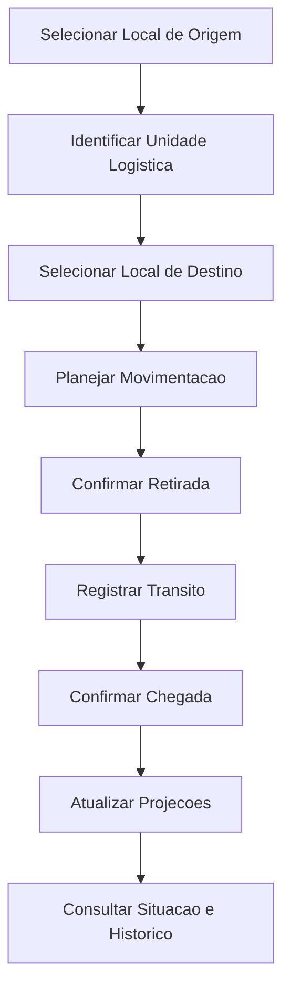

# AS-0005 - Arquitetura da Primeira Vertical Funcional do Dominio de Estoque

## 1. Identificacao

| Campo | Valor |
|---|---|
| Codigo | AS-0005 |
| Titulo | Arquitetura da Primeira Vertical Funcional do Dominio de Estoque |
| Status | Aprovada |
| Data da sessao | 2026-07-24 |
| Data da ultima revisao | 2026-07-24 |
| Responsavel pelo produto | Lucas Zanardi |
| Dominio ou bounded context | Dominio de Estoque |
| Origem | Definicao da primeira vertical funcional apos AS-0004, antes da retomada da implementacao. |

Participantes:

- Product Owner / Responsavel pelo Projeto MES.
- ChatGPT, no papel de apoio arquitetural.
- Codex, no papel de documentador tecnico.

Documentos relacionados:

- `../README.md`
- `../11 - Roadmap/Roadmap Geral.md`
- `../12 - Decision Log/README.md`
- `AS-0001 - Arquitetura de Enderecamento e Localizacao de Estoque.md`
- `AS-0002 - Movimentacoes de Estoque e Operacao Assistida.md`
- `AS-0003 - Arquitetura de Integracao Sincronizacao Governanca e Eventos.md`
- `AS-0004 - Arquitetura do Dominio de Estoque.md`
- `../12 - Decision Log/DL-0022 - Estoque como Dominio e Saldo como Projecao.md`
- `../12 - Decision Log/DL-0023 - Unidade Logistica como Agregado Fisico.md`
- `../12 - Decision Log/DL-0024 - Local de Estoque como Aggregate Root.md`
- `../12 - Decision Log/DL-0025 - Movimentacao de Estoque como Processo Operacional.md`
- `../12 - Decision Log/DL-0029 - Autoridade de Dominio Auditoria e Eventos.md`
- `../20 - Glossario Arquitetural/Glossario Arquitetural do MES.md`
- `../01 - Visão Geral do Projeto/INVENTARIO_FUNCIONAL.md`
- `../05 - Estoque/Estoque.md`

## 2. Contexto

O Roadmap Geral define que, apos a AS-0004, a proxima etapa planejada e implementar uma primeira vertical funcional do estoque. O mesmo roadmap condiciona a implementacao a revisao da AS-0004, aprovacao dos DLs, validacao do Project Book, definicao da primeira vertical funcional e arquitetura tecnica de backend e frontend.

A AS-0004 consolidou o Dominio de Estoque e definiu LocalDeEstoque, UnidadeLogistica e MovimentacaoDeEstoque como conceitos centrais. O inventario funcional registra que o codigo possui entidades, controllers e telas de estoque, mas que as regras transacionais de saldo, movimento, reserva, bloqueio, ajuste e inventario nao estao confirmadas como fluxo operacional completo.

Na perspectiva ISA-95, a AS-0005 permanece no nivel de operacoes de manufatura/MES. Ela nao define ERP, fiscal, PLC, SCADA, sequenciamento, apontamento de producao ou automacao industrial.

Motivo de prioridade: a primeira vertical funcional de Estoque e a menor fatia que desbloqueia retomada de codigo com aderencia ao dominio aprovado e reduz risco de tratar CRUD como processo operacional concluido.

## 3. Objetivos

Validar ponta a ponta o fluxo:

```text
Local de Estoque
-> Unidade Logistica
-> Movimentacao
-> Confirmacao
-> Consulta
-> Historico
```

Objetivos verificaveis:

- definir o recorte funcional minimo da primeira vertical de Estoque;
- preservar a separacao entre LocalDeEstoque e LocalizacaoEstoque;
- operar sobre UnidadeLogistica, ainda que a interface possa simplificar a experiencia;
- tratar MovimentacaoDeEstoque como processo com inicio, transito e confirmacao;
- consultar saldo, ocupacao e historico como projecoes derivadas;
- separar comandos, eventos, estados, alertas e projecoes;
- definir Definition of Ready para retomada da codificacao.

## 4. Fora de escopo

- implementacao de codigo;
- migrations;
- schema fisico definitivo;
- endpoints reais;
- telas;
- autenticacao/login;
- ReservaDeEstoque, Recebimento, Inventario e Ajuste de Estoque completos;
- MRP, abastecimento da producao e apontamento;
- integracao ERP/WMS/SCADA/PLC/OPC UA/MQTT;
- mobile, coletor, RFID ou offline como obrigatorios.

## 5. Premissas

- AS-0004 e DL-0022 a DL-0029 permanecem vigentes.
- A vertical deve ser pequena, demonstravel e testavel.
- O codigo legado de estoque e evidencia de implementacao existente, mas nao e autoridade de dominio.
- Backlog documental esta vazio no estado analisado; roadmap, AS-0004, inventario funcional e documentacao de estoque sustentam a prioridade.
- Quando um detalhe nao estiver definido, este documento registra: Nao definido nesta Architecture Session.

## 6. Terminologia e linguagem ubiqua

`LocalDeEstoque`: Aggregate Root do dominio de Estoque que representa endereco ou espaco fisico governado.

`LocalizacaoEstoque`: referencia de posicionamento atual de uma Unidade Logistica; nao e Aggregate Root concorrente.

`UnidadeLogistica`: objeto fisico identificavel, manipulavel e rastreavel.

`MovimentacaoDeEstoque`: processo operacional com inicio, transito e fim confirmados.

`Confirmacao`: ato operacional que registra fato fisico observado, como retirada ou chegada.

`Consulta`: leitura derivada por projecao ou read model, sem autoridade para alterar o dominio.

`Historico`: trilha imutavel de eventos, comandos aceitos, auditoria e fatos operacionais confirmados.

`Alerta Operacional Derivado`: sinal produzido por monitoramento, projecao ou servico operacional; nao e necessariamente evento de dominio.

## 7. Fronteiras do dominio

Pertence ao MES:

- LocalDeEstoque usado pela vertical;
- identidade e ciclo minimo da UnidadeLogistica;
- processo de MovimentacaoDeEstoque;
- confirmacoes operacionais;
- eventos de dominio;
- historico e auditoria operacional;
- projecoes de consulta derivadas de fatos confirmados.

Dados sob autoridade do dominio:

- estado operacional da movimentacao;
- posicao confirmada da UnidadeLogistica;
- historico de retirada, transito, chegada, cancelamento e divergencia;
- correlacao e causacao do fluxo.

Dados apenas referenciados: Produto, LoteMaterial, UnidadeMedida, usuario/ator, tenant, planta e estrutura legada de LocalizacaoEstoque quando usada como compatibilidade.

Pertence ao ERP: pedido de compra, documento fiscal, planejamento financeiro e saldos contabeis.

Pertence ao chao de fabrica: retirada fisica, transporte real, chegada fisica e leitura de identificador configuravel.

Pertence a servicos compartilhados: autenticacao, autorizacao tecnica, notificacoes, observabilidade e infraestrutura de eventos.

## 8. Capacidades do dominio

| Capacidade | Responsabilidade |
|---|---|
| Preparar LocalDeEstoque | Consultar local apto para origem/destino. |
| Identificar UnidadeLogistica | Garantir objeto rastreavel para a operacao. |
| Planejar Movimentacao | Registrar intencao operacional validada. |
| Iniciar Movimentacao | Confirmar retirada e colocar UL em transito. |
| Confirmar Chegada | Registrar chegada fisica e concluir movimentacao. |
| Consultar Situacao | Exibir posicao, estado e historico por UL/local/movimentacao. |
| Registrar Historico | Preservar eventos, auditoria, correlacao e causacao. |

## 9. Casos de uso

| Caso | Ator | Gatilho | Pre-condicoes | Fluxo principal | Alternativos/falhas | Pos-condicoes | Idempotencia/Auditoria/Autorizacao |
|---|---|---|---|---|---|---|---|
| Consultar Local de Estoque | Operador/lider/sistema | Selecionar origem ou destino | Local cadastrado e nao desativado | Consultar local, estado, capacidade e restricoes | Local bloqueado, desativado, incompativel ou sem permissao | Local elegivel ou rejeitado | Consulta nao altera estado; autorizacao por escopo quando definida |
| Identificar Unidade Logistica | Operador/sistema | Leitura ou selecao da UL | UL existente, ativa e apta | Identificar UL e localizacao atual | UL inexistente, bloqueada, encerrada ou em movimentacao | UL selecionada ou rejeitada | Repetir identificacao nao altera estado; operacoes criticas auditaveis |
| Planejar Movimentacao | Operador/lider/sistema | Necessidade de mover UL | UL apta, origem confirmada, destino elegivel | Solicitar e validar movimentacao | Destino bloqueado, capacidade insuficiente, conflito | Movimentacao criada ou rejeitada | Idempotency key obrigatoria; auditar comando aceito |
| Iniciar Movimentacao | Operador | Retirada fisica | Movimentacao planejada e UL na origem esperada | Confirmar retirada e registrar transito | Divergencia, leitura invalida, duplicidade | UL em transito | Idempotencia obrigatoria; auditoria obrigatoria |
| Confirmar Chegada | Operador | Chegada fisica ao destino | Movimentacao em transito e destino elegivel | Validar destino e concluir | Destino invalido, divergencia, cancelamento | UL posicionada no destino | Idempotencia obrigatoria; auditoria obrigatoria |
| Consultar Historico | Operador/lider/auditor | Necessidade de rastrear | Eventos ou historico existentes | Consultar por UL, local ou movimentacao | Sem dados, projecao defasada, acesso negado | Historico apresentado | Consulta nao altera estado; auditoria de consulta sensivel nao definida |

## 10. Modelo de dominio

### Aggregate Roots

`LocalDeEstoque`: protege identidade, estado, capacidade e restricoes do local. Nesta vertical e usado principalmente para validacao e consulta. Motivo para ser Aggregate Root: definido na AS-0004 e DL-0024.

`UnidadeLogistica`: representa objeto fisico rastreavel movimentado. A UL deve estar ativa e nao pode participar de duas movimentacoes ativas simultaneamente. Motivo para ser Aggregate Root: definido na AS-0004 e DL-0023.

`MovimentacaoDeEstoque`: conduz o processo de mover UL entre origem e destino. Possui identidade, ciclo de vida, comandos, eventos, concorrencia e auditoria proprios. Motivo para ser Aggregate Root: definido na AS-0004 e DL-0025.

### Entidades, Value Objects e servicos

- Entidades internas novas: Nao definido nesta Architecture Session.
- Value Objects: Identificador de UL, LocalizacaoEstoque como referencia de posicionamento futuro, IdempotencyKey.
- Servicos de dominio: validacao de elegibilidade, validacao de destino e coordenacao de confirmacao de chegada.
- Politicas: excecao para local bloqueado e consumo de UL em transito nao definidos nesta Architecture Session.
- Projecoes: SituacaoAtualDaUL, OcupacaoDoLocal, MovimentacoesAbertas, HistoricoDaUL, HistoricoDoLocal.

## 11. Invariantes

INV-AS0005-001 - Uma UnidadeLogistica nao pode possuir duas MovimentacoesDeEstoque ativas simultaneamente. Validar em criacao, planejamento, inicio e confirmacao. Violacao rejeita comando e registra falha auditavel.

INV-AS0005-002 - Local desativado nao pode ser origem ou destino de nova movimentacao. Validar em planejamento, inicio e confirmacao. Violacao rejeita comando.

INV-AS0005-003 - Local bloqueado nao pode receber UL, salvo politica excepcional explicita. Validar em planejamento e confirmacao de chegada. Violacao rejeita comando ou registra divergencia conforme politica.

INV-AS0005-004 - A localizacao final da UL somente muda apos confirmacao fisica de chegada. Validar na confirmacao. Violacao impede conclusao automatica.

INV-AS0005-005 - Retirada confirmada nao equivale a chegada confirmada. Validar em inicio, retirada e consulta. Violacao mantem movimentacao aberta/em transito.

INV-AS0005-006 - Projecoes de saldo, ocupacao e historico nao sao fonte primaria de verdade. Validar em consultas e comandos que usem read models. Violacao exige revalidacao do dominio.

INV-AS0005-007 - Comandos duplicados com mesma idempotency key nao podem duplicar movimentacao ou eventos. Validar em comandos criticos. Violacao retorna resultado anterior ou rejeita duplicidade controlada.

INV-AS0005-008 - Evento de dominio deve representar fato ocorrido no passado. Validar na publicacao/registro. Violacao exige reclassificacao como comando, estado, alerta ou projecao.

## 12. Estados e transicoes

Estados validos de MovimentacaoDeEstoque nesta vertical:

- Criada;
- Planejada;
- AguardandoRetirada;
- RetiradaConfirmada;
- EmTransito;
- AguardandoConfirmacao;
- Concluida;
- Suspensa;
- Cancelada;
- Expirada;
- Divergente.

| Estado atual | Comando | Evento resultante | Proximo estado |
|---|---|---|---|
| Criada | PlanejarMovimentacao | MovimentacaoPlanejada | Planejada |
| Planejada | IniciarMovimentacao | MovimentacaoIniciada | AguardandoRetirada |
| AguardandoRetirada | ConfirmarRetirada | UnidadeLogisticaRetirada | RetiradaConfirmada |
| RetiradaConfirmada | IniciarTransito | TransitoDaMovimentacaoIniciado | EmTransito |
| EmTransito | SolicitarConfirmacaoDeChegada | Nao definido nesta Architecture Session | AguardandoConfirmacao |
| AguardandoConfirmacao | ConfirmarChegada | MovimentacaoConcluida | Concluida |
| Ativa | SuspenderMovimentacao | MovimentacaoSuspensa | Suspensa |
| Suspensa | RetomarMovimentacao | MovimentacaoRetomada | estado anterior, se preservado |
| Ativa | CancelarMovimentacao | MovimentacaoCancelada | Cancelada |
| Ativa | RegistrarDivergenciaDeMovimentacao | DivergenciaDeMovimentacaoIdentificada | Divergente |
| Ativa | ExpirarMovimentacao | MovimentacaoExpirada | Expirada |

Transicoes proibidas: Concluida para EmTransito; Cancelada para Concluida; Expirada para Concluida sem nova decisao; Divergente para Concluida sem tratamento formal; EmTransito para Concluida sem confirmacao de chegada.

## 13. Comandos

| Comando | Intencao | Agregado | Pre-condicoes | Resultado | Falhas |
|---|---|---|---|---|---|
| PlanejarMovimentacao | Solicitar movimentacao futura de UL | MovimentacaoDeEstoque | UL apta, origem e destino elegiveis | MovimentacaoPlanejada | UL em outra movimentacao, local invalido, permissao insuficiente |
| IniciarMovimentacao | Iniciar processo operacional | MovimentacaoDeEstoque | Movimentacao planejada | MovimentacaoIniciada | Estado invalido, duplicidade |
| ConfirmarRetirada | Registrar retirada fisica | MovimentacaoDeEstoque | UL na origem esperada | UnidadeLogisticaRetirada | UL nao encontrada, origem divergente |
| IniciarTransito | Registrar inicio de transito | MovimentacaoDeEstoque | Retirada confirmada | TransitoDaMovimentacaoIniciado | Estado invalido |
| ConfirmarChegada | Registrar chegada no destino | MovimentacaoDeEstoque | Movimentacao em transito ou aguardando confirmacao | MovimentacaoConcluida | Destino invalido, divergencia, duplicidade |
| SuspenderMovimentacao | Suspender temporariamente processo | MovimentacaoDeEstoque | Movimentacao ativa | MovimentacaoSuspensa | Estado nao suspendivel |
| RetomarMovimentacao | Retomar processo suspenso | MovimentacaoDeEstoque | Movimentacao suspensa | MovimentacaoRetomada | Estado invalido |
| CancelarMovimentacao | Cancelar processo nao concluido | MovimentacaoDeEstoque | Movimentacao nao concluida | MovimentacaoCancelada | Estado invalido, permissao insuficiente |
| RegistrarDivergenciaDeMovimentacao | Registrar divergencia operacional | MovimentacaoDeEstoque | Evidencia de divergencia | DivergenciaDeMovimentacaoIdentificada | Dados insuficientes |
| ExpirarMovimentacao | Encerrar por prazo/politica | MovimentacaoDeEstoque | Regra temporal aplicavel | MovimentacaoExpirada | Politica nao definida |

## 14. Eventos de dominio

Todos os eventos devem usar o envelope comum da AS-0004: `eventId`, `eventType`, `eventVersion`, `occurredAt`, `aggregateId`, `aggregateType`, `correlationId`, `causationId`, `tenantId`, `plantId`, `actorId` e `source`.

| Evento | Fato ocorrido | Agregado | Consumidores esperados | Versao inicial |
|---|---|---|---|---|
| MovimentacaoPlanejada | Uma movimentacao foi planejada | MovimentacaoDeEstoque | Projecoes, auditoria | 1 |
| MovimentacaoIniciada | Uma movimentacao foi iniciada | MovimentacaoDeEstoque | Projecoes, auditoria | 1 |
| UnidadeLogisticaRetirada | Uma UL foi retirada da origem | MovimentacaoDeEstoque | Projecao de transito, historico | 1 |
| TransitoDaMovimentacaoIniciado | O transito da movimentacao foi iniciado | MovimentacaoDeEstoque | Painel operacional, historico | 1 |
| MovimentacaoConcluida | Uma movimentacao foi concluida | MovimentacaoDeEstoque | Projecoes de localizacao, historico | 1 |
| MovimentacaoSuspensa | Uma movimentacao foi suspensa | MovimentacaoDeEstoque | Painel operacional, auditoria | 1 |
| MovimentacaoRetomada | Uma movimentacao foi retomada | MovimentacaoDeEstoque | Painel operacional, auditoria | 1 |
| DivergenciaDeMovimentacaoIdentificada | Uma divergencia foi identificada | MovimentacaoDeEstoque | Historico, auditoria | 1 |
| MovimentacaoCancelada | Uma movimentacao foi cancelada | MovimentacaoDeEstoque | Projecoes, auditoria | 1 |
| MovimentacaoExpirada | Uma movimentacao expirou | MovimentacaoDeEstoque | Painel operacional, auditoria | 1 |

Eventos de integracao: Nao definido nesta Architecture Session.

Alertas operacionais derivados: LimiteDeTempoDaMovimentacaoAproximado e AtrasoDeMovimentacaoDetectado.

Projecoes nao sao eventos e nao devem ser tratadas como fonte de verdade.

## 15. Regras de autorizacao

- Planejar movimentacao exige permissao operacional no escopo de tenant, planta e armazem.
- Confirmar retirada exige permissao operacional e identificacao do ator.
- Confirmar chegada exige permissao operacional e identificacao do ator.
- Suspender, cancelar, expirar ou registrar divergencia pode exigir permissao mais restrita.
- Override administrativo para violar invariante de dominio nao e permitido.
- Politicas de aprovacao e segregacao de funcao: Nao definido nesta Architecture Session.
- Roles fixas do codigo atual nao sao autoridade arquitetural para esta AS.

## 16. Auditoria e rastreabilidade

Operacoes criticas devem registrar ator, data e hora, tenant, planta, origem da solicitacao, dispositivo ou estacao quando disponivel, comando, resultado, motivo, estado anterior, estado posterior, correlationId, causationId, idempotency key e evidencia operacional quando aplicavel.

Historico deve permitir reconstruir onde a UL estava, quem retirou, quando entrou em transito, quando chegou, qual divergencia ocorreu e qual comando causou cada evento.

Retencao e imutabilidade fisica: Nao definido nesta Architecture Session.

## 17. Concorrencia e consistencia

- Comandos criticos devem usar idempotency key.
- MovimentacaoDeEstoque deve possuir versionamento de agregado ou mecanismo equivalente.
- Confirmacoes duplicadas nao podem gerar eventos duplicados.
- Uma UL nao pode ser movimentada por dois processos ativos simultaneos.
- Projecoes podem estar defasadas e nao substituem validacao de dominio.
- Coordenacao entre LocalDeEstoque, UnidadeLogistica e MovimentacaoDeEstoque nao deve exigir transacao distribuida global.
- Compensacoes e reconciliacao automatica de projecoes: Nao definido nesta Architecture Session.

## 18. Projecoes e consultas

| Projecao | Finalidade | Origem dos dados | Chave | Atualizacao | Consistencia esperada | Reconstrucao | Uso pela interface |
|---|---|---|---|---|---|---|---|
| SituacaoAtualDaUL | Exibir estado, local e movimentacao atual | Eventos e estado operacional | unidadeLogisticaId | Eventos confirmados | Eventual controlada | Reprocessar eventos da UL | Consulta principal da UL |
| OcupacaoDoLocal | Exibir ULs e ocupacao por LocalDeEstoque | Eventos de movimentacao concluida | localDeEstoqueId | Eventos confirmados | Eventual controlada | Reprocessar eventos por local | Consulta por local |
| MovimentacoesAbertas | Monitorar retiradas sem chegada | Eventos de movimentacao | movimentacaoId/status | Eventos e estados | Quase tempo real quando possivel | Recalcular por estados ativos | Painel operacional |
| HistoricoDaUL | Rastrear jornada da UL | Eventos, auditoria e comandos aceitos | unidadeLogisticaId | Append-only | Completa conforme eventos persistidos | Reprocessar trilha historica | Auditoria e consulta |
| HistoricoDoLocal | Rastrear entradas/saidas por local | Eventos de movimentacao | localDeEstoqueId | Append-only/projetada | Eventual | Reprocessar eventos por local | Consulta historica |

## 19. Integracoes

| Origem | Destino | Dado/Evento | Direcao | Sincronismo | Autoridade | Falha/retentativa |
|---|---|---|---|---|---|---|
| Cadastro | Estoque | Produto, lote, unidade, local | Cadastro -> Estoque | Consulta/referencia | Cadastro | Nao definido nesta Architecture Session |
| Identidade | Estoque | ator, permissao, escopo | Identidade -> Estoque | Sincrono na autorizacao | Identidade | Rejeitar comando sem autorizacao |
| Estoque | Projecoes | eventos de movimentacao | Dominio -> Read models | Assincrono ou local | Estoque | Reprocessar por correlationId/eventId |
| Estoque | Auditoria | comandos e eventos | Dominio -> Auditoria | Sincrono/local ou assincrono | Estoque | Nao definido nesta Architecture Session |
| ERP/SCADA/PLC/OPC UA/MQTT | Estoque | Nao definido | Nao definido | Nao definido | Nao definido | Nao definido nesta Architecture Session |

## 20. Fluxos principais



```text
Comando aceito
-> validacao de invariantes
-> alteracao do agregado
-> evento de dominio
-> auditoria
-> projecao
-> consulta
```

## 21. Persistencia conceitual

Agregados persistidos: MovimentacaoDeEstoque, UnidadeLogistica e LocalDeEstoque.

Eventos: eventos de dominio de MovimentacaoDeEstoque definidos nesta AS.

Projecoes: SituacaoAtualDaUL, OcupacaoDoLocal, MovimentacoesAbertas, HistoricoDaUL e HistoricoDoLocal.

Historico: deve preservar eventos, comandos aceitos e auditoria operacional.

Anexos, evidencias, banco temporal ou armazenamento de objetos: Nao definido nesta Architecture Session.

## 22. APIs conceituais

| Operacao | Tipo | Intencao | Entrada | Saida | Erros | Idempotencia | Autorizacao |
|---|---|---|---|---|---|---|---|
| Planejar movimentacao | Comando | Criar processo planejado | UL, origem, destino, motivo | movimentacaoId | local/UL invalido, permissao | obrigatoria | operacional |
| Confirmar retirada | Comando | Registrar retirada fisica | movimentacaoId, UL, origem, evidencia | evento/estado | divergencia, duplicidade | obrigatoria | operacional |
| Confirmar chegada | Comando | Concluir movimentacao | movimentacaoId, destino, evidencia | evento/estado | destino invalido, divergencia | obrigatoria | operacional |
| Suspender movimentacao | Comando | Pausar processo | movimentacaoId, motivo | estado/evento | estado invalido | obrigatoria | restrita |
| Cancelar movimentacao | Comando | Cancelar processo | movimentacaoId, motivo | estado/evento | estado invalido | obrigatoria | restrita |
| Registrar divergencia | Comando | Registrar problema operacional | movimentacaoId, descricao, evidencia | estado/evento | dados insuficientes | obrigatoria | operacional/restrita |
| Consultar situacao da UL | Consulta | Exibir estado atual | unidadeLogisticaId | situacao projetada | nao encontrada | consulta | escopo |
| Consultar local | Consulta | Exibir ocupacao/local | localDeEstoqueId | ocupacao projetada | nao encontrado | consulta | escopo |
| Consultar movimentacao | Consulta | Exibir processo | movimentacaoId | estado/historico | nao encontrada | consulta | escopo |
| Consultar historico | Consulta | Rastrear eventos | UL/local/movimentacao | trilha historica | sem dados/permissao | consulta | escopo/auditoria |

Callbacks externos: Nao definido nesta Architecture Session.

## 23. Experiencia do usuario

Personas: operador de estoque, lider de estoque, auditor/responsavel por rastreabilidade e administrador funcional de permissao.

Jornada minima:

1. selecionar ou ler local de origem;
2. ler ou selecionar UL;
3. selecionar destino;
4. confirmar retirada;
5. confirmar chegada;
6. visualizar situacao e historico.

A UI deve simplificar leitura por codigo de barras, QR Code, RFID ou identificador configuravel, exibicao de UL explicita/implicita/virtual, validacoes de bloqueio, destino, estado e permissao, e mensagens claras de conflito.

A UI nao deve permitir edicao direta de saldo, ocultar divergencias criticas, tratar consulta projetada como verdade transacional ou transferir ao operador toda a complexidade interna do dominio.

Offline e dispositivo alvo: Nao definido nesta Architecture Session.

## 24. Requisitos nao funcionais

- Rastreabilidade obrigatoria para comandos criticos.
- Integridade protegida por invariantes antes de produzir eventos.
- Seguranca por acao e escopo, sem roles fixas acopladas.
- Resiliencia por idempotency key em comandos duplicados.
- Observabilidade com correlationId e causationId.
- Multi-tenant e multi-planta aparecem no envelope conceitual; modelo fisico nao definido.
- Metas quantitativas de desempenho e offline: Nao definido nesta Architecture Session.

## 25. Observabilidade

- Logs estruturados para comandos aceitos, rejeitados e eventos produzidos.
- Metricas para movimentacoes abertas, concluidas, suspensas, divergentes e expiradas.
- Traces com correlationId e causationId.
- Alertas derivados: LimiteDeTempoDaMovimentacaoAproximado e AtrasoDeMovimentacaoDetectado.
- Health checks, filas mortas e retentativas: Nao definido nesta Architecture Session.

## 26. Seguranca industrial e corporativa

- Autenticacao e servico compartilhado, nao definida por esta AS.
- Autorizacao deve seguir menor privilegio.
- Protecao contra repeticao por idempotency key em comandos criticos.
- Comandos devem registrar source.
- Segregacao OT/IT, credenciais, TLS, gestao de segredos e operacao degradada: Nao definido nesta Architecture Session.

## 27. Estrategia de testes

- Testes de invariantes INV-AS0005-001 a INV-AS0005-008.
- Testes de transicao de estado de MovimentacaoDeEstoque.
- Testes de comando duplicado com idempotency key.
- Testes de concorrencia para duas movimentacoes da mesma UL.
- Testes de autorizacao por acao e escopo.
- Testes de contrato conceitual para comandos e consultas.
- Testes de projecao para situacao atual, ocupacao e historico.
- Testes end-to-end futuros para Local -> UL -> Movimentacao -> Confirmacao -> Consulta -> Historico.

## 28. Migracao e compatibilidade

| Item legado | Evidencia | Classificacao |
|---|---|---|
| `LocalizacaoEstoque` | Documentacao funcional e codigo existente | Adaptar conceitualmente para referencia de posicionamento, sem criar AR concorrente |
| `MovimentoEstoque` | Entidade/controller/telas existentes | Investigar aderencia a MovimentacaoDeEstoque como processo |
| `TransferenciaEstoque` | Fluxo parcial existente | Investigar se pode ser adaptada para vertical de movimentacao |
| `SaldoEstoque` | Consulta e entidade existente | Usar como projecao/read model se aderente; nao como fonte primaria |
| Telas de entrada/saida/transferencia | Frontend operacional existente | Adaptar ou substituir conforme aderencia futura |
| TODOs de saldo/movimento | Inventario funcional | Resolver antes de implementar comportamento transacional |

Nao definir migracao irreversivel nesta sessao.

## 29. Decisoes arquiteturais

### DA-AS0005-001 - Escopo da primeira vertical funcional

- Contexto: roadmap exige definicao da primeira vertical antes de implementar.
- Decisao: a primeira vertical sera Local de Estoque -> Unidade Logistica -> Movimentacao -> Confirmacao -> Consulta -> Historico.
- Alternativas: iniciar por Recebimento, Reserva, Inventario, Autenticacao ou Producao.
- Consequencias positivas: valida o nucleo do dominio de Estoque e reduz risco antes de fluxos maiores.
- Consequencias negativas: nao entrega reserva, recebimento ou inventario completos.
- Riscos: vertical grande demais se incluir ajustes nao essenciais.
- Estado: aprovada.
- Necessidade de Decision Log: sim.

### DA-AS0005-002 - Codigo legado como insumo, nao autoridade

- Contexto: inventario funcional registra entidades e telas parciais de estoque, mas lacunas transacionais.
- Decisao: implementacao existente deve ser avaliada como insumo reutilizavel/adaptavel, nao como autoridade de dominio.
- Alternativas: adaptar cegamente o legado; descartar todo o legado; reimplementar sem mapeamento.
- Consequencias positivas: preserva valor existente e evita consolidar comportamento incorreto.
- Consequencias negativas: exige analise de aderencia antes de codificar.
- Riscos: subestimar divergencias entre legado e arquitetura.
- Estado: aprovada.
- Necessidade de Decision Log: sim.

### DA-AS0005-003 - Definition of Ready obrigatoria para retomada da codificacao

- Contexto: roadmap condiciona implementacao a validacao arquitetural e tecnica.
- Decisao: a codificacao so deve retomar quando a Definition of Ready desta AS estiver satisfeita.
- Alternativas: iniciar codigo apenas com AS-0004; iniciar por telas; iniciar por migrations.
- Consequencias positivas: reduz retrabalho e protege invariantes.
- Consequencias negativas: posterga implementacao ate resolver bloqueadores.
- Riscos: tratar checklist como burocracia sem validacao real.
- Estado: aprovada.
- Necessidade de Decision Log: sim.

## 30. Riscos e questoes em aberto

| Item | Classificacao | Observacao |
|---|---|---|
| Definir schema fisico antes da arquitetura tecnica | Bloqueador | Nao deve ocorrer nesta AS. |
| Resolver `LocalizacaoEstoque` como AR concorrente | Bloqueador | AS-0004 proibiu essa interpretacao. |
| Tratar `SaldoEstoque` como fonte primaria | Bloqueador | Contraria AS-0004 e DL-0022. |
| Regras de saldo automatico nao confirmadas | Relevante | Inventario funcional registra lacuna. |
| Endpoint/tela legado divergente | Relevante | Deve ser investigado antes da implementacao. |
| Offline/coletor/RFID | Evolucao futura | Nao definido nesta AS. |
| Reservas, recebimento, inventario e ajuste | Evolucao futura | Permanecem fora do recorte minimo. |

## 31. Impactos na implementacao futura

| Area | Item | Impacto |
|---|---|---|
| Backend dominio | Entidades de estoque atuais | Investigar/adaptar |
| Backend services | Services de Movimento/Transferencia/Saldo | Investigar/adaptar |
| Backend controllers | Controllers de estoque existentes | Investigar/adaptar ou substituir por comandos conceituais |
| DTOs | DTOs de estoque atuais | Investigar/adaptar |
| Validators | Validacoes atuais | Adaptar para invariantes aprovadas |
| Repositories | Persistencia generica atual | Investigar aderencia a agregados |
| Mappings/migrations | Estrutura atual de estoque | Investigar; nao criar migration nesta AS |
| Frontend operacao | entrada/saida/transferencia | Adaptar ou substituir conforme vertical |
| Frontend consulta | telas/servicos de saldo/localizacao | Adaptar como projecoes |
| Testes | inexistencia ou nao confirmacao | Criar conforme estrategia futura |

## 32. Fatias de implementacao recomendadas

| Fatia | Objetivo | Valor | Dependencias | Criterio de aceite | Risco |
|---|---|---|---|---|---|
| 1 | Diagnostico tecnico do legado de estoque | Evitar retrabalho | AS-0005 aprovada | Relatorio de aderencia | Subestimar divergencias |
| 2 | Modelo conceitual minimo em backend | Proteger invariantes | Fatia 1 | Invariantes testadas | Acoplamento ao legado |
| 3 | Comandos de movimentacao | Validar fluxo operacional | Fatia 2 | Local -> UL -> Confirmacao funcionando | Concorrencia |
| 4 | Projecoes e consultas | Dar visibilidade | Fatia 3 | Consultas coerentes com eventos | Defasagem nao comunicada |
| 5 | End-to-end operacional | Demonstrar vertical | Fatia 4 | Fluxo completo validado | UX complexa |

## 33. Definition of Ready para voltar a codificar

- [ ] Escopo da vertical aprovado.
- [ ] Linguagem ubiqua validada.
- [ ] Agregados participantes aprovados.
- [ ] Invariantes INV-AS0005-001 a INV-AS0005-008 aprovadas.
- [ ] Comandos aprovados.
- [ ] Eventos aprovados e no passado.
- [ ] Estados separados de eventos e alertas.
- [ ] Contratos minimos de comandos e consultas definidos.
- [ ] Autorizacao por acao e escopo definida.
- [ ] Estrategia de persistencia validada tecnicamente.
- [ ] Impacto no legado avaliado.
- [ ] Estrategia de migracao definida ou declarada inexistente para a fatia.
- [ ] Primeira vertical slice escolhida.
- [ ] Criterios de aceite definidos.
- [ ] Testes planejados.
- [ ] Dependencias externas disponiveis ou explicitamente fora do escopo.
- [ ] Pendencias bloqueadoras resolvidas.

## 34. Criterios de aceite da AS-0005

1. O escopo esta sustentado por evidencias do roadmap, AS-0004 e inventario funcional.
2. As fronteiras estao claras entre dominio, legado, ERP, chao de fabrica e servicos compartilhados.
3. Agregados e invariantes estao justificados por AS-0004 e DLs anteriores.
4. Comandos, eventos, estados e alertas estao separados.
5. Integracoes e autoridades de dados estao definidas ou marcadas como nao definidas.
6. Impactos sobre codigo atual estao mapeados sem alterar codigo.
7. Ha sequencia incremental de implementacao.
8. Ha Definition of Ready para retomada da codificacao.
9. Nao existem contradicoes nao registradas com AS-0001 a AS-0004.
10. Questoes nao resolvidas estao classificadas.

## 35. Matriz de diagnostico do escopo

| Tema candidato | Evidencias | Dependencias | Valor para retomada do codigo | Risco de antecipacao | Recomendacao |
|---|---|---|---|---|---|
| Primeira vertical funcional de Estoque | Roadmap Onda 2; AS-0004 proximos passos; Inventario funcional com estoque parcial | AS-0004 e DL-0022 a DL-0029 | Alto | Medio, se incluir reserva/recebimento/inventario | Escolhido |
| Autenticacao e login | Roadmap Onda 3; funcionalidade ja implementada | Revisao de seguranca | Medio | Alto, pois vem depois da vertical no roadmap | Aguardar AS futura |
| Gestao da Producao | Roadmap Onda 4 | Estoque/disponibilidade | Alto futuro | Alto, pois depende de estoque | Aguardar Domain Discovery |
| MRP | Roadmap Onda 5 | Produto, estoque, producao | Alto futuro | Alto | Aguardar estoque e producao |
| Apontamento | Roadmap Onda 6 | Ordem, operacao, recursos, estoque | Alto futuro | Alto | Aguardar producao |
| Qualidade/OEE/IA | Roadmap Onda 7 | Dados operacionais maduros | Medio futuro | Alto | Nao escolher agora |

## 36. Impactos das pendencias da AS-0004

- Eventos de movimentacao foram mantidos como fatos no passado.
- Estados de MovimentacaoDeEstoque nao foram catalogados como eventos.
- Alertas derivados foram separados dos eventos de dominio.
- `LocalizacaoEstoque` permanece referencia de posicionamento e nao Aggregate Root concorrente.
- `LocalDeEstoque` permanece Aggregate Root do dominio.
- `TarefaDeContagem` nao participa desta vertical.
- O envelope comum de eventos da AS-0004 foi reutilizado.

## 37. Decision Logs Relacionados

- DL-0022 - Estoque como Dominio e Saldo como Projecao
- DL-0023 - Unidade Logistica como Agregado Fisico
- DL-0024 - Local de Estoque como Aggregate Root
- DL-0025 - Movimentacao de Estoque como Processo Operacional
- DL-0029 - Autoridade de Dominio Auditoria e Eventos
- DL-0030 - Primeira Vertical Funcional do Dominio de Estoque
- DL-0031 - Codigo Legado de Estoque como Insumo de Implementacao
- DL-0032 - Definition of Ready para Retomada da Codificacao

## 38. Conclusao

A AS-0005 define a primeira vertical funcional do Dominio de Estoque como recorte minimo para retomar implementacao com seguranca: Local de Estoque, Unidade Logistica, Movimentacao, Confirmacao, Consulta e Historico.

Nenhuma implementacao foi iniciada.

## 39. Proximos Passos

1. Revisao humana da AS-0005.
2. Revisao humana dos DL-0030 a DL-0032.
3. Validacao tecnica do legado de estoque contra a AS-0005.
4. Definicao da arquitetura tecnica de backend.
5. Definicao da arquitetura tecnica de frontend.
6. Implementacao somente apos Definition of Ready satisfeita.
